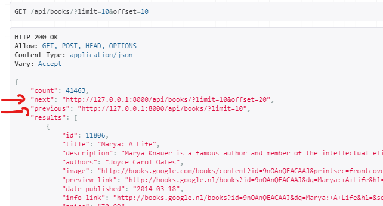

# Le travail assisté(suite) : Django DRF

À ce stade, votre projet de **bookstore** avec les applications *website* et *books_api* devrait être opérationnel. Vous devriez également disposer d'une API de base permettant des opérations CRUD sur le modèle de livre. Nous allons poursuivre notre apprentissage et notre pratique à partir de là.

## Pagination

avons eu du mal à accéder à la ressource /books jusqu'à présent. Cela est dû à la grande quantité de données que nous avons dans notre base de données. Une manière de garantir que nous pouvons toujours permettre à nos clients API d'accéder à toutes nos données sans causer de problèmes de performance sur notre serveur est de définir la pagination. La pagination permet aux clients de récupérer des morceaux de nos données à chaque requête qu'ils font à notre API au lieu d'essayer de renvoyer tout d'un coup. 

1. Pour utiliser la pagination, mettez à jour le paramètre REST_FRAMEWORK dans le fichier settings.py comme suit :

```python
REST_FRAMEWORK = {
    'DEFAULT_PAGINATION_CLASS': 'rest_framework.pagination.LimitOffsetPagination',
    'PAGE_SIZE': 100
}
```

2. Dans votre navigateur, accédez à /api/books et vous constaterez que l'application ne tente plus de récupérer tous les objets Book, mais en récupère seulement 10 à la fois.

L'API navigable affichera également certains numéroous les éléments en passant d'une page à l'autre.  

Vous remarquerez également que les données JSON renvoyées comportent un lien vers la page suivante(`next`), et incluraient également un lien vers la page précédente(`previous`) des données. Vous pouvez utiliser ces deux valeurs pour avancer ou reculer dans le jeu de résultats.

3. Copiez la valeur de la propriété next et utilisez-la pour passer à la page suivante. Les résultats affichés auront maintenant des valeurs pour les pages previous et next dans le jeu de résultats. 

# Formats: DRF Parsers

DRF nous permet de spécifier le format de la réponse que nous obtenons d'une API. Nous pourrions le faire en ajoutant, par exemple, l'extension `.api` à l'URL de notre requête et DRF contactera le bon parseur dans votre code pour analyser le contenu de la réponse afin de correspondre au format spécifié. L'interface API navigable que nous avons utilisée peut également être consultée en utilisant l'extension `.api`. 

4. Testez l'accès à l'API navigable depuis `/api/books.api`. Vous devriez toujours pouvoir voir l'API navigable.
5. Et que dire de `/api/books/11859.api` ? Si vous recevez une erreur, assurez vous que le code dans `books_api.views.BookViewSets.retrieve` resemble bel et bien a ce qui suit:
```python
def retrieve(self, request, pk, *args, **kwargs):
    book = models.Book.objects.get(id=pk)
    book.increment_view_count()
    return Response(serializers.BookSerializer(book).data)
```

## Désactiver l'API navigable

Souvent, vous ne permettriez l'accès à l'API navigable que dans un environnement contrôlé. En production, il est très improbable que vous l'utilisiez. Désactivons-le pour l'instant.

6. Ajoutez le code suivant à l'objet de configuration REST_FRAMEWORK :

```lua
"DEFAULT_RENDERER_CLASSES": ["rest_framework.renderers.JSONRenderer",]
```
Ce paramètre indique à DRF d'utiliser rest_framework.renderers.JSONRenderer comme le rendu par défaut pour votre API. Toute réponse sera renvoyée au format JSON


## Tests dans DRF

Nous avons observé que Django propose une classe TestCase qui hérite de unittest.TestCase, nous fournissant des méthodes pour tester notre logique liée au code Django. Django Rest Framework fournit également des outils qui nous permettent de tester nos API facilement, sans avoir à écrire un code excessif. Un de ces outils est la classe `rest_framework.test.APITestCase`, qui nous offre un client API virtuel similaire à Postman.

Commençons par ajouter les tests suivants pour notre API dans `books_api/tests.py`. Ces tests assurent que notre API peut :

7. Testons si nous pouvons obtenir la liste de tous les objets. Nous faisons cela en créant d'abord quelques objets dans la base de données, puis en effectuant une requête vers notre API pour vérifier si les données renvoyées contiennent tous les objets qui ont été enregistrés dans la base de données. Ci-dessous se trouve le code

```python
from unittest import TestCase as UnitTestTestCase

import factory
from books_api import serializers
from django.urls import reverse
from rest_framework import status
from rest_framework.test import APITestCase
from website import models


class PublisherFactory(factory.django.DjangoModelFactory):
    class Meta:
        model = models.Publisher


class NoCategoryBookFactory(factory.django.DjangoModelFactory):
    class Meta:
        model = models.Book

    publisher = factory.SubFactory(PublisherFactory)
    date_published = factory.Faker("date_time")
    price = factory.Faker("pydecimal", left_digits=1, right_digits=2, positive=True)
    rating = factory.Faker("pydecimal", left_digits=1, right_digits=2, positive=True)


class CategoryFactory(factory.django.DjangoModelFactory):
    class Meta:
        model = models.Category


class BookTest(APITestCase):
    def test_list_books(self):
        books = NoCategoryBookFactory.create_batch(10)

        response = self.client.get("/api/books.json")
        results = response.json().get("results")

        self.assertEqual(response.status_code, 200)

        id_list_from_response = list(map(lambda b: b.get("id"), results))
        id_list_from_database = list(map(lambda b: b.id, books))

        self.assertEqual(id_list_from_response, id_list_from_database)
```

> Lors des tests d'API, nous testons toujours d'abord le code status de réponse, avant de tester la fonctionnalité. C'est une pratique courante dans les codes de test d'API. Dans note cas, c'est l'instruction suivante qui testera le code status de la réponse:
```python
self.assertEqual(response.status_code, 200)
```

8. Utilisez la commande suivante pour exécuter tous les tests dans l'application books_api
```bash
python manage.py test books_api
```

## Plus de pratique

Pratiquons le flux de travail pour développer des APIs dont nous avons discuté hier.


Étant donné que nous avons déjà nos modèles, nous allons nous concentrer sur les éléments que nous n'avons pas encore. 

9. Commençons par le modèle Publisher, créez une classe de sérialiseur pour ce model qui hérite de rest_framework.serializers.ModelSerializer. Assurez-vous de nommer la classe `PublisherModelSerializer`. Il doit traiter tous les champs du modèle Publisher.
10. Ajoutons le code suivant à nos tests.
```python 
class PublisherModelSerializerTests(UnitTestTestCase):
    def test_can_serialize(self):
        publisher = PublisherFactory.build()
        pub_serializer = serializers.PublisherModelSerializer(publisher)
        self.assertEqual(pub_serializer.data.get("name"), publisher.name)
```
11. Executez la commande de test suivante pour vérifier que notre sérialiseur fonctionne comme prévu.
```bash
python manage.py test books_api
```
Nous exécutons tous les tests dans notre application books_api. À l'avenir, nous n'afficherons plus cette commande. Elle sera implicite chaque fois que vous devrez exécuter des tests. 

Votre sortie devrait indiquer que 2 tests ont été exécutés avec succès.


12. Ensuite, créons une classe pour un ensemble de vues qui géreront les requêtes vers `/api/publishers`. Cette classe doit hériter de `rest_framework.viewsets.ModelViewSet` et être nommé `PublisherViewsets`.
13. Ensuite, ajoutez la configuration de routage pour le viewset comme suit :


14.  Ajoutons le code suivant dans nos tests. Ces tests testent différentes méthodes sur les points de terminaison `/api/publishers`. Prenez le temps de les étudier et de les comprendre.
```python
class PublisherViewTest(APITestCase):
    def test_list_publishers(self):
        """Celci testera la méthode GET sur /api/publishers.json."""
        publishers = PublisherFactory.create_batch(10)

        response = self.client.get("/api/publishers.json")
        results = response.json().get("results")

        self.assertEqual(response.status_code, 200)

        id_list_from_response = list(map(lambda b: b.get("id"), results))
        id_list_from_database = list(map(lambda b: b.id, publishers))

        self.assertEqual(id_list_from_response, id_list_from_database)

    def test_retrieve_publisher(self):
        """Celci testera la méthode GET sur /api/publishers\[:publisher_id].json."""
        publisher = PublisherFactory.create()

        response = self.client.get(f"/api/publishers/{publisher.id}.json")
        publisher_json_response = response.json()

        self.assertEqual(response.status_code, 200)
        self.assertEqual(publisher_json_response.get("id"), publisher.id)

    def test_create_publisher(self):
        """Celci testera la méthode POST sur /api/publishers.json."""
        new_publisher_data = {"name": "Paris Edition"}

        response = self.client.post(
            "/api/publishers.json", new_publisher_data, format="json"
        )
        publisher_json_response = response.json()

        self.assertEqual(response.status_code, 201)  # HTTP 201 CREATED
        self.assertEqual(
            publisher_json_response.get("name"), new_publisher_data.get("name")
        )

    def test_update_publisher(self):
        """Celci testera la méthode PUT sur /api/publishers/[:publisher_id].json."""
        exiting_publisher = PublisherFactory.create()
        exiting_publisher_updated_data = {"name": "New Edition"}

        response = self.client.put(
            f"/api/publishers/{exiting_publisher.id}.json",
            exiting_publisher_updated_data,
            format="json",
        )

        exiting_publisher.refresh_from_db()  # instance.refresh_from_db() Collecte la dernière version
        # de cette instance de modèle depuis la base de données.

        self.assertEqual(response.status_code, 200)
        self.assertEqual(
            exiting_publisher.name, exiting_publisher_updated_data.get("name")
        )
```
15. En exécutant les tests, vous devriez maintenant voir passer 6 tests.
16. Suivez les mêmes étapes pour ajouter un sérialiseur, une classe ModelViewSe(`CategoryViewsets`) et configurer le routage pour les catégories également.
17. Ajoutez le code suivant aux tests et tester le code. Vous devriez avoir 10 tests passants
```python
class CategoryViewTest(APITestCase):
    def test_list_categories(self):
        """Celci testera la méthode GET sur /api/categories.json."""
        categories = CategoryFactory.create_batch(10)

        response = self.client.get("/api/categories.json")
        results = response.json().get("results")

        self.assertEqual(response.status_code, 200)

        id_list_from_response = list(map(lambda b: b.get("id"), results))
        id_list_from_database = list(map(lambda b: b.id, categories))

        self.assertEqual(id_list_from_response, id_list_from_database)

    def test_retrieve_category(self):
        """Celci testera la méthode GET sur /api/categories/[:category_id].json."""
        category = CategoryFactory.create()

        response = self.client.get(f"/api/categories/{category.id}.json")
        category_json_response = response.json()

        self.assertEqual(response.status_code, 200)
        self.assertEqual(category_json_response.get("id"), category.id)

    def test_create_category(self):
        """Celci testera la méthode POST sur /api/categories.json."""
        new_category_data = {"name": "Paris Categorie"}

        response = self.client.post(
            "/api/categories.json", new_category_data, format="json"
        )
        category_json_response = response.json()

        self.assertEqual(response.status_code, 201)
        self.assertEqual(
            category_json_response.get("name"), new_category_data.get("name")
        )

    def test_update_category(self):
        """Celci testera la méthode PUT sur /api/categories/[:category_id].json."""
        exiting_category = CategoryFactory.create()
        exiting_category_updated_data = {"name": "New Category"}

        response = self.client.put(
            f"/api/categories/{exiting_category.id}.json",
            exiting_category_updated_data,
            format="json",
        )

        exiting_category.refresh_from_db()

        self.assertEqual(response.status_code, 200)
        self.assertEqual(
            exiting_category.name, exiting_category_updated_data.get("name")
        )
```
