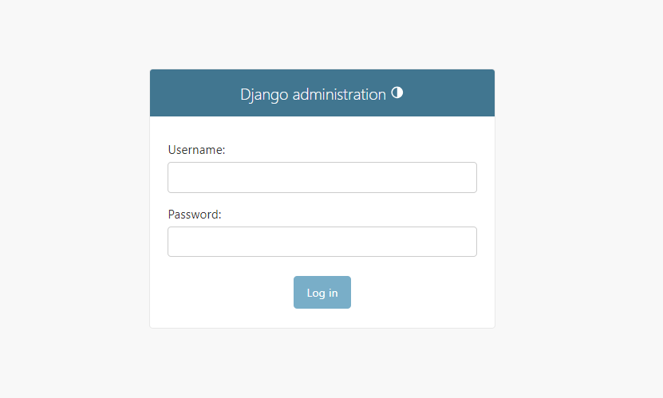
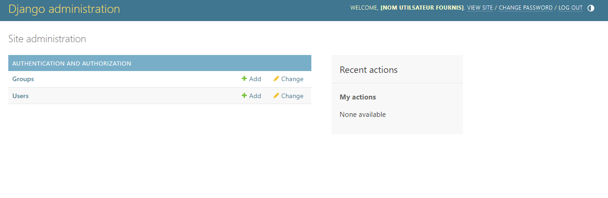
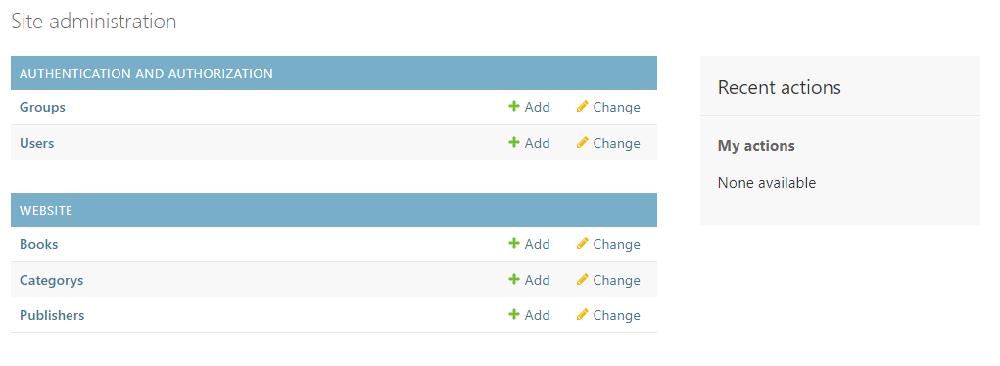
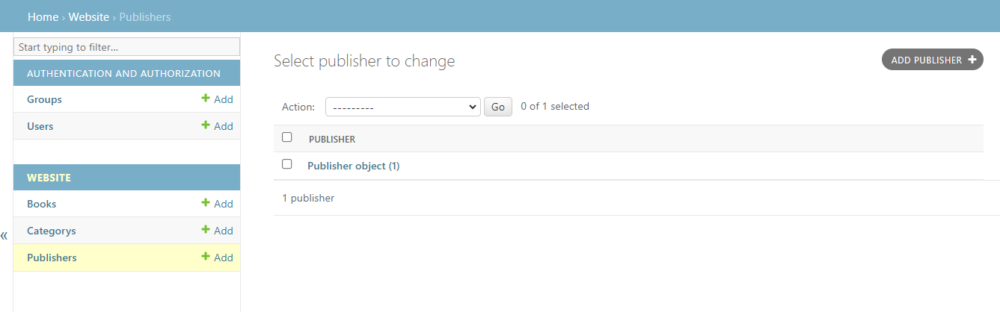
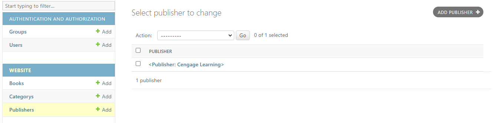
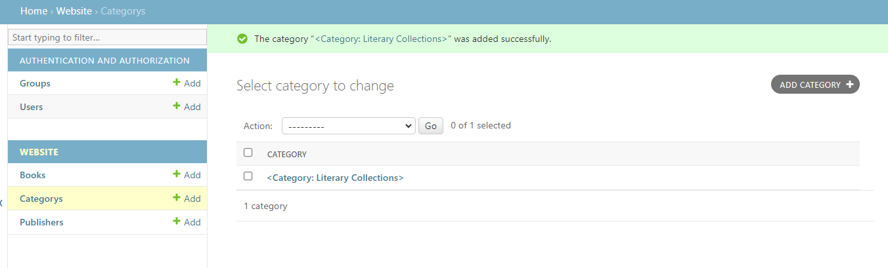
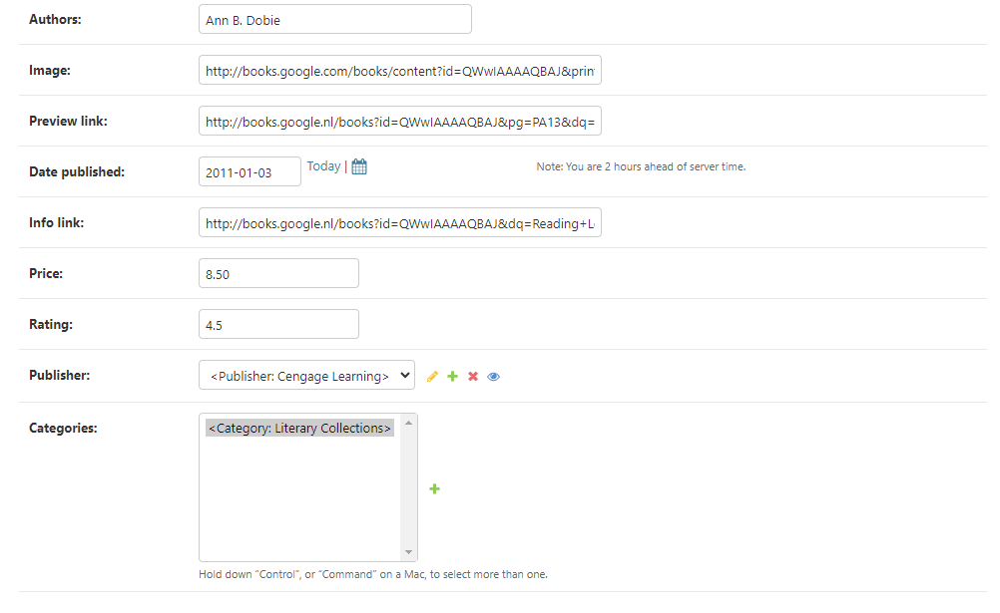

# TP assistE Bookstore

1. Créez un dossier pour le travail qui sera accompli. Assurez-vous de suivre les normes de nommage Python pour toutes les ressources que vous créez tout au long de ce projet. Nous nommerons le dossier **assisted_tp**.
2. `cd` dans le dossier **assisted_tp** et créez un nouvel environnement virtuel Python nommé `.env`.
3. Assurez-vous d'être dans le dossier **assisted_tp** et activez l'environnement virtuel que nous venons de créer.
4. Installez dans l'environnement virtuel les dépendances suivantes

```lua
asgiref==3.7.2
coverage==7.3.2
Django==4.2.7
djangorestframework==3.14.0
fontawesomefree==6.4.2
factory-boy==3.3.0
Faker==20.1.0
psycopg2==2.9.9
python-dateutil==2.8.2
pytz==2023.3.post1
six==1.16.0
sqlparse==0.4.4
tzdata==2023.3
```

1. Générer un nouveau projet Django nommé `bookstore`.
2. À ce stade, la structure de votre dossier devrait ressembler à ceci :

```lua
assisted_tp/
|-- bookstore/
|   |-- manage.py
|   |-- bookstore/
|       |-- __init__.py
|       |-- settings.py
|       |-- urls.py
|       |-- asgi.py
|       |-- wsgi.py
|-- .env
```

7. Renommez le dossier supérieur **bookstore** en **project**. La structure devrait ressembler à l'image ci-dessous. Notez comment le dossier supérieur a maintenant un nom différent de celui du dossier interne contenant les configurations de votre projet.

```lua
assisted_tp/
|-- project/
|   |-- manage.py
|   |-- bookstore/
|       |-- __init__.py
|       |-- settings.py
|       |-- urls.py
|       |-- asgi.py
|       |-- wsgi.py
|-- .env
```

8. Assurez-vous de vous déplacer (`cd`) dans le dossier du projet, qui est maintenant nommé de manière pratique **project**, et créez une nouvelle application Django **website**.

```lua
assisted_tp/
|-- project/
|   |-- manage.py
|   |-- bookstore/
|   |-- website/
|-- .env
```

9. Ajoutez la nouvelle application créée à la liste des applications installées de notre projet.
10. Créez une classe Publisher dans l'application website avec un seul attribut nommé name, qui doit être de type CharField avec une longueur maximale égale à 100.
11. Créez les migrations de la base de données et appliquez-les. Pour cela, n'oubliez pas les commandes `makemigrations` et `migrate`.
12. À mesure que nous avançons dans ce projet assisté, nous testerons certaines fonctionnalités en cours de route pour garantir la cohérence du projet. Cela sera possible en utilisant des tests unitaires. Voyons comment cela fonctionne avec Django.Commençons par copier le contenu du fichier à [cet emplacement](./tests.py) et collez-le dans le fichier test à l'emplacement `project/website/tests.py`. Nous créons le modèle Publisher à partir de l'étape précédente. Pour nous assurer que tout est en ordre, lançons un test qui vérifiera que nous avons fait les bonnes choses et que nous pouvons créer un objet Publisher dans nos applications. Pour ce faire, utilisez la commande suivante : `python manage.py test website.tests.PublisherModelTestCase.test_can_create_publisher`. Cela devrait renvoyer la sortie suivante :

```lua
Found 1 test(s).
Creating test database for alias 'default'...
System check identified no issues (0 silenced).
.
----------------------------------------------------------------------
Ran 1 test in 0.004s

OK
Destroying test database for alias 'default'...
```
Ce que vous recherchez dans la sortie, c'est le texte `Found 1 test(s).`, `Ran 1 test in x.xxs` et ` OK`. Toute autre sortie que celle-ci signifie qu'il y a eu un problème.

13. Ensuite, nous créons un modèle *Category*. Tout comme le modèle *Publisher*, le modèle de catégorie a seulement un attribut, un attribut *name* avec les mêmes spécifications. N'oubliez pas de mettre à jour la structure de votre base de données en créant et en appliquant une nouvelle migration.
14. Exécutez la commande de test suivante pour vous assurer que vous pouvez créer des objets *Category* dans notre base de données: `python manage.py test website.tests.CategoryModelTestCase.test_can_create_category`
15. Vous devriez obtenir une sortie similaire à celle précédente après avoir exécuté le test.

```lua
Found 1 test(s).
Creating test database for alias 'default'...
System check identified no issues (0 silenced).
.
----------------------------------------------------------------------
Ran 1 test in 0.004s

OK
Destroying test database for alias 'default'...
```

16. La beauté d'écrire des tests pour votre projet et vos applications réside dans le fait de savoir que les modifications apportées depuis la dernière exécution des tests ne provoquent pas de problèmes ou ne cassent pas votre code. Par conséquent, nous exécutons tous les tests de notre application, appelés la *suite de tests*, pour nous assurer que tout fonctionne toujours comme prévu. Dans notre cas, nous n'avons créé que deux modèles Django jusqu'à présent, alors exécutons tous les tests que nous avons vus jusqu'à présent pour nous assurer que rien n'est cassé. 
    
> Veuillez exécuter les commandes suivantes une par une pour vous assurer que vous pouvez confirmer que tout fonctionne toujours correctement.

```bash
python manage.py test website.tests.PublisherModelTestCase.test_can_create_publisher 
python manage.py test website.tests.CategoryModelTestCase.test_can_create_category
```

17. Enfin, nous allons créer un modèle "Book" avec les attributs suivants:

```lua
title: CharField(max_length=300, null=False, blank=False)
description: TextField()
authors: CharField(max_length=300)
image: URLField(null=False, max_length=500)
preview_link: URLField(null=True, max_length=500)
date_published: DateField(null=False)
info_link: URLField(null=True, max_length=500)
price: DecimalField(max_digits=5, decimal_places=2)
rating: DecimalField(max_digits=3, decimal_places=2)
```

18. Nous allons également ajouter les relations suivantes :

- Un livre ne peut avoir qu'un seul éditeur (indice : Clé étrangère)
- Un livre peut avoir une ou plusieurs catégories (indice : Many-to-many)

19. Exécutez la commande suivante pour tester si les étapes 17 et 18 ont été mises en œuvre avec succès:

```bash
python manage.py test website.tests.BookModelTestCase.test_can_create_book
python manage.py test website.tests.BookModelTestCase.test_can_add_categories_to_book
```

20. Nous avons parlé de l'interface d'administration que Django fournit par défaut. Faisons un peu de travail avec elle. Nous l'utiliserons pour ajouter des données réelles à notre base de données. L'interface n'est disponible que lorsque votre projet est en cours d'exécution. Par conséquent, la première chose à faire est de démarrer le serveur de développement Django.
21. Une fois le serveur de développement en cours d'exécution, dans votre navigateur web préféré, accédez à l'emplacement `/admin` de votre projet. Ça devrait ressembler à ce qui suit

22. Nous n'avons pas encore de nom d'utilisateur et de mot de passe. Pour créer des identifiants d'authentification, retournez dans le terminal et saisissez la commande suivante :
```bash
python manage.py createsuperuser
```
Répondez aux invitations pour le nom d'utilisateur, l'e-mail et le mot de passe. Vous utiliserez le nom d'utilisateur et le mot de passe spécifiés pour vous connecter à l'interface d'administration.

23. Connectez-vous à l'interface d'administration en utilisant les identifiants fournis.
24. Ouvrez le fichier `admin.py` dans le dossier de l'application website et remplacez le code actuel par ce qui suit :
```python
from django.contrib import admin

from . import models

admin.site.register(models.Book)
admin.site.register(models.Category)
admin.site.register(models.Publisher)
```

25. Retournez à l'interface d'administration, actualisez la page, et vous devriez voir plus de contenu qu'auparavant, similaire à ce qui suit .
26. Vous pouvez cliquer sur **Books**, **Categories**, ou **Publishers** pour afficher, ajouter, supprimer ou modifier des objets à partir de ces modèles Django. Faisons exactement cela. Cliquez sur **Publishers** et vous devriez voir une page vide car nous n'avons pas encore créé d'objet Publisher. Cliquez sur le bouton **ADD PUBLISHER +** en haut à droite de l'écran et saisissez le nom **Cengage Learning** pour le nouveau Publisher et sauvegarder. L'interface devrait maintenant afficher un élément dans la liste des objets Publisher existants.   
27. Nous pouvons modifier la façon dont les modèles Django sont présentés à l'écran. Au lieu de voir **Publisher object (1)**, nous pouvons afficher quelque chose de significatif à la place. Pour ce faire, mettez à jour la définition de la classe d'objet *Publisher* dans `website.models.py` comme suit :
```python
class Publisher(models.Model):
    name = models.CharField(max_length=100)

    def __str__(self):
        return f"<Publisher: {self.name}>"
```
29. Exécutez le test suivant pour vous assurer que vous avez correctement modifié la manière dont une instance d'objet *Publisher* est affichée : `python manage.py test website.tests.PublisherModelTestCase.test_model_str_method_has_instance_name_in_it`
30. Retournez à l'interface d'administration et actualisez la page. Vous remarquerez que le nom de l'éditeur est maintenant affiché au lieu du texte moins utile qui était affiché auparavant.
31. Effectuez la même opération pour Category et Book
32. De la même manière que vous ajoutez un éditeur via l'interface d'administration, ajoutez une nouvelle catégorie avec le nom "Literary Collections".
33. "Enfin, ajoutons un livre et attachons-lui la catégorie et l'éditeur existants. Le livre doit avoir les détails suivants :
```json
{
    "title": "Reading Lessons: An Introduction to Theory",
    "description": "Beginning with approaches familiar to students and then gradually introducing schools of criticism that are more challenging, THEORY INTO PRACTICE provides extensive step-by-step guidance for writing literary analyses from each of the critical perspectives. This brief, practical introduction to literary theory explores core literary theories in a unique chronological format and includes an anthology of relevant fiction, poetry, and nonfiction to help bring those theories to life for students. Remarkably readable and engaging, the text makes even complex concepts manageable for those beginning to think about literary theory, and example analyses for each type of criticism show how real students have applied the theories to works included in the anthology. Now updated with the latest scholarship, including a full discussion of Ecocriticism and increased emphasis on American multicultural approaches, THEORY INTO PRACTICE provides an essential foundation for thoughtful and effective literary analysis. Important Notice: Media content referenced within the product description or the product text may not be available in the ebook version.",
    "authors": "Ann B. Dobie",
    "image": "http://books.google.com/books/content?id=QWwIAAAAQBAJ&printsec=frontcover&img=1&zoom=1&edge=curl&source=gbs_api",
    "preview_link": "http://books.google.nl/books?id=QWwIAAAAQBAJ&pg=PA13&dq=Reading+Lessons:+An+Introduction+to+Theory&hl=&cd=1&source=gbs_api",
    "date_published": "2011-01-03",
    "info_link": "http://books.google.nl/books?id=QWwIAAAAQBAJ&dq=Reading+Lessons:+An+Introduction+to+Theory&hl=&source=gbs_api",
    }
```


C'est ainsi que fonctionne l'interface d'administration Django. C'est un outil utile pour gérer de manière transparente les données de votre site.
