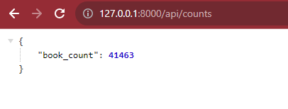
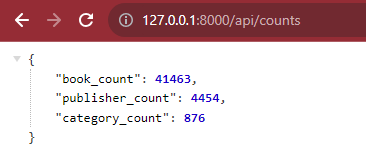
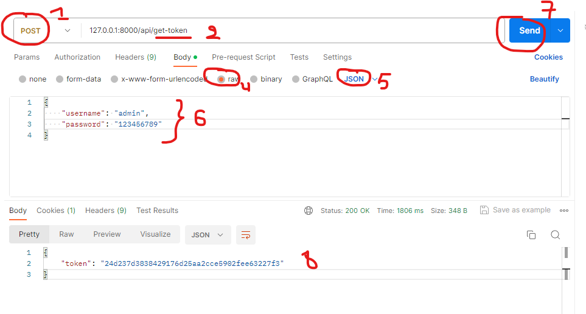

# Foncions API View, Authentification, autorisations 

## Les foncions API View

Jusqu'à présent, nous avons travaillé uniquement avec des vues étroitement liées à des modèles existants. Mais que faire si nous voulons créer une vue qui n'a rien à voir avec une classe spécifique ? Et si nous voulions obtenir des données agrégées à partir de différents modèles ? Une manière d'écrire des vues indépendantes ou autonomes est d'utiliser le décorateur api_view. Cela nous permettra d'écrire des fonctions comme nous l'avons fait avec Django et d'avoir des routes traitées par ces fonctions.

Nous allons créer une fonction qui renvoie un objet nous indiquant combien de livres nous avons dans la base de données

1. Importez le décorateur `api_view` dans `views.py` comme suit :
```python
from rest_framework.decorators import api_view
```

Ensuite, ajoutez la fonction suivante, toujours à l'intérieur de `views.py` :
```python
@api_view(["GET"])
def book_count(request):
    data = {"book_count": models.Book.objects.all().count()}
    return Response(data)
```
C'est similaire à ce que nous avions l'habitude de faire avec Django, à l'exception du nouvel élément @api_view. Ce dernier transforme une fonction ordinaire comme *book_count* en une vue que DRF peut inclure dans notre API.

La dernière chose que nous devons faire est d'ajouter la configuration de routage pour cette fonction. Pour cela, modifiez la valeur de `books_api.urls.urlpatterns` pour correspondre à ce qui suit :
```python
urlpatterns = router.urls + [path("counts", views.book_count)]
```
Ensuite, testez le point de terminaison `/api/counts` et vous devriez obtenir quelque chose de similaire à ce qui suit, avec une propriété vous montrant combien de livres existent dans votre base de données


2. Modifiez la fonction book_count pour inclure également le décompte des objets Publisher et Category.



## Authentification

Notez qu'il est possible pour n'importe qui d'accéder à l'API pour consulter, modifier, voire supprimer des données dans notre base de données. Une manière de garantir que nous pouvons protéger et limiter l'utilisation ainsi que les autorisations de notre API est de configurer l'authentification. Commençons par l'authentification.

Nous avons précédemment créé un compte superutilisateur en exécutant la commande `python manage.py` createsuperuser. Si vous vous souvenez toujours de vos informations d'identification, n'hésitez pas à passer à la section suivante. Si vous avez oublié vos informations d'identification, vous pouvez créer un autre compte en exécutant à nouveau la même commande, en fournissant le nom d'utilisateur, l'e-mail et le mot de passe. Assurez-vous de conserver le nom d'utilisateur et le mot de passe à portée de main afin de vous en souvenir.

Nous utiliserons ces informations d'identification pour nous authentifier auprès de notre API. La section suivante montre comment exiger une authentification pour accéder à l'API.

3. Commençons par indiquer à DRF comment demander aux utilisateurs de s'authentifier. Ajoutez le code suivant dans les paramètres REST_FRAMEWORK :
```python
"DEFAULT_AUTHENTICATION_CLASSES": [
    "rest_framework.authentication.TokenAuthentication"
]
```

Le code ci-dessus indique à DRF que nous aimerions utiliser son module d'authentification par token pour l'authentification. Ce module générera un jeton que les utilisateurs souhaitant utiliser notre API devront fournir avec chaque requête qu'ils font à l'API. Le processus nécessitera que l'utilisateur s'authentifie d'abord en utilisant son nom d'utilisateur et son mot de passe, et en cas de succès, un jeton API leur sera attribué pour effectuer des requêtes.

4. Ensuite, ajoutez l'application `rest_framework.authtoken` à INSTALLED_APPS dans nos paramètres. Cette application est livrée avec ses propres migrations que vous devrez appliquer, alors exécutez la commande de gestion pour le faire.


5. Maintenant, passons à la vue que nous utiliserons pour l'authentification. À l'intérieur de views.py, importez les modules suivants
```
from django.contrib.auth import authenticate
from rest_framework.authtoken.models import Token
```

`django.contrib.auth import.authenticate` est utilisé pour vérifier qu'une combinaison nom d'utilisateur-mot de passe correspond à un utilisateur spécifique, et `rest_framework.authtoken.models import Token` est le modèle chargé de gérer les jetons.

6. Voici la fonction qui récupérera d'abord le nom d'utilisateur et le mot de passe fournis et vérifiera si cette combinaison correspond à un utilisateur existant. Si oui, elle renverra un utilisateur. Sinon, elle renverra une réponse `400 Bad Request`.
```python
@api_view(["POST"])
def get_token(request):
    username = request.data.get("username")
    password = request.data.get("password")
    user = authenticate(username=username, password=password)

    if user:
        token, _ = Token.objects.get_or_create(user=user)
        return Response({"token": token.key})
    else:
        return Response({"error": "Wrong Credentials"}, status=400)

```
Si nous obtenons un utilisateur, nous générerons un jeton et le renverrons dans la réponse de réussite

7. Ensuite, ajoutez ce qui suit aux URLs : `path("get-token", views.get_token)`

8. Essayez de vous authentifier en utilisant le nom d'utilisateur et le mot de passe que vous avez créés au début de cette section en utilisant Postman comme suit



